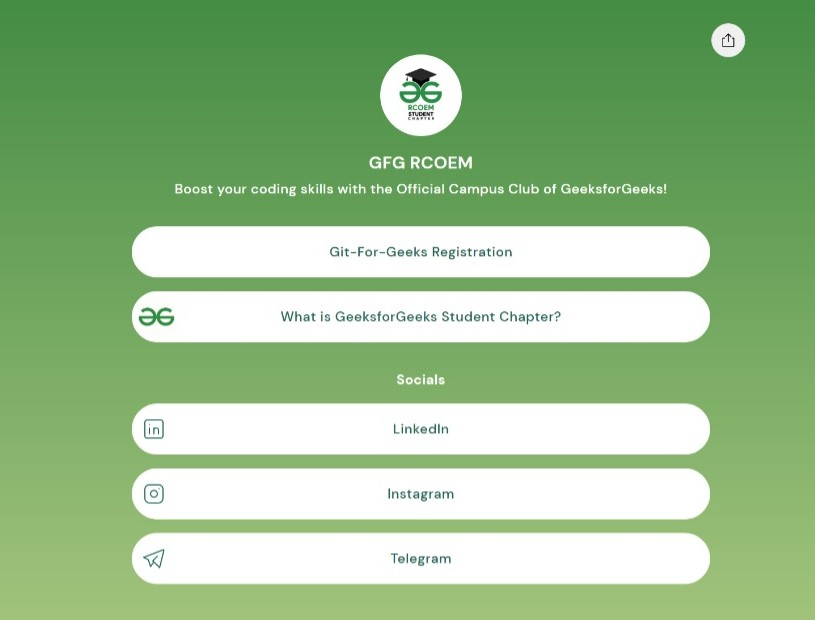

# Lets-Contribute
This is a starter repository for all the budding developers who want to learn Open Source. This is a repository made under the Event Git-For-Geeks

# Let’s Create our First Pull Request !!

Lets dive into hands on opensource by creating our first Pull Request.
Follow these steps

1. Clone this repository
2. Create a folder of your name into the Profile folder. If your name is `GFG` then make a foler of `GFG` 
3. Into that folder create a basic [Linktree](https://linktr.ee/gfgrcoem) like UI where you have your Name as a heading and some Social media buttons that would Redirect to your Social Media Handles.
4. The UI should Look like this 
    
    </img>
    
5. After the Web Page is ready commit the changes into the repository and **create your PR.**
6. Wait for the PR to be merged.
7. **Hola !! you made your First PR !!**

#  Dil Maange More ??
### Want to contribute more ??
1. Hop on to practice problems on Geeks For Geeks.
2. Solve any of the problems and contribute your solution into the Code Folder.
3. In the folder make another folder of your name.
4. Create a questionName.cpp or any other language extension file and create a pull request. **If question was HelloWorld then the file should be HelloWorld.cpp**
5. Create the Pull Request and wait for it to be merged.
6. Hola You made your 2nd PR !! 
